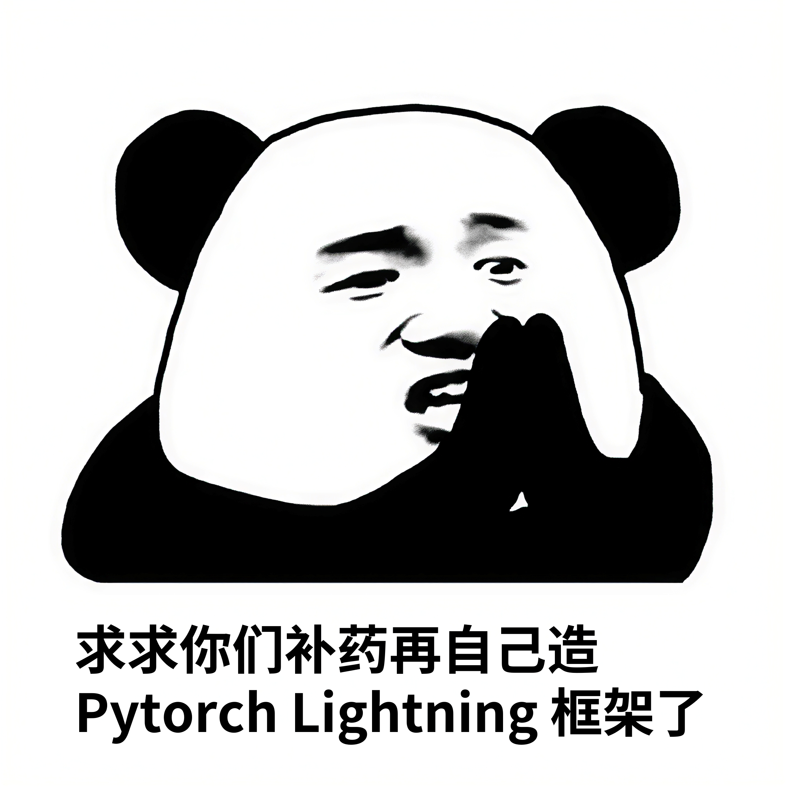

# ***⚡ [TmPL](): [T]()e[mpl]()ate for [P]()ytorch [L]()ightning***


[](LICENSE)


[Lightning Docs](https://lightning.ai/docs/pytorch/stable/) &nbsp;•&nbsp;
[Installation](#installation) &nbsp;•&nbsp;
[Usage](#usage) &nbsp;•&nbsp;
[Reference](#reference) &nbsp;•&nbsp;
[Contributing](#contributing) &nbsp;•&nbsp;
[License](#license)

A template for rapid & flexible DL experimentation development, powered by [Lightning](https://lightning.ai/) & [Hydra](https://hydra.cc/) following best practice.

<div align="center">

</div>

## Installation

```
pip install -r requirements.txt
```

## Usage

0. **Setup**

    ```bash
    export PYTHONPATH=`pwd`:$PYTHONPATH
    ```

1. **Training**

    ```bash
    python tools/train.py [--config-name config[.yaml]] [trainer.devices=4] [data.loader.batch_size=16]
    ```

    * Specify the configuration file using `--config-name`.
    * Refer to the following for detailed information on Hydra's override syntax.
        * https://hydra.cc/docs/advanced/hydra-command-line-flags/
        * https://hydra.cc/docs/advanced/override_grammar/basic/

2. **Tips for Further Development**

    This framework is designed for flexibility and easy customization to meet users' specific needs.
    Useful comments and details on extending the framework can be found within the source code files.

## Reference

- [PyTorch Lightning Docs ↗](https://lightning.ai/docs/pytorch/stable/)
- [Hydra Docs ↗](https://hydra.cc/docs/intro/)

## Contributing

Contributions are welcome and appreciated! \
Feel free to open an issue or PR! 🎉

## License

Released under the [MIT](LICENSE) License.
